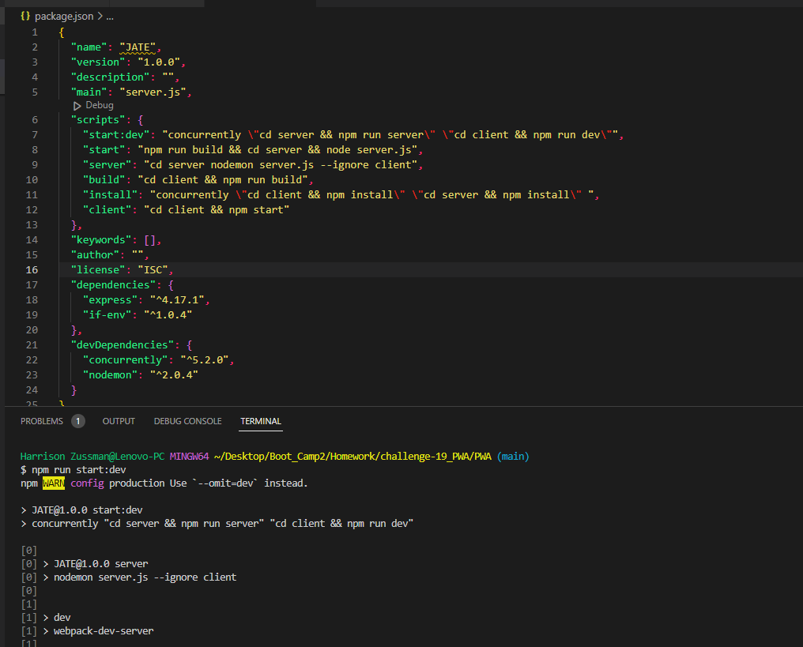
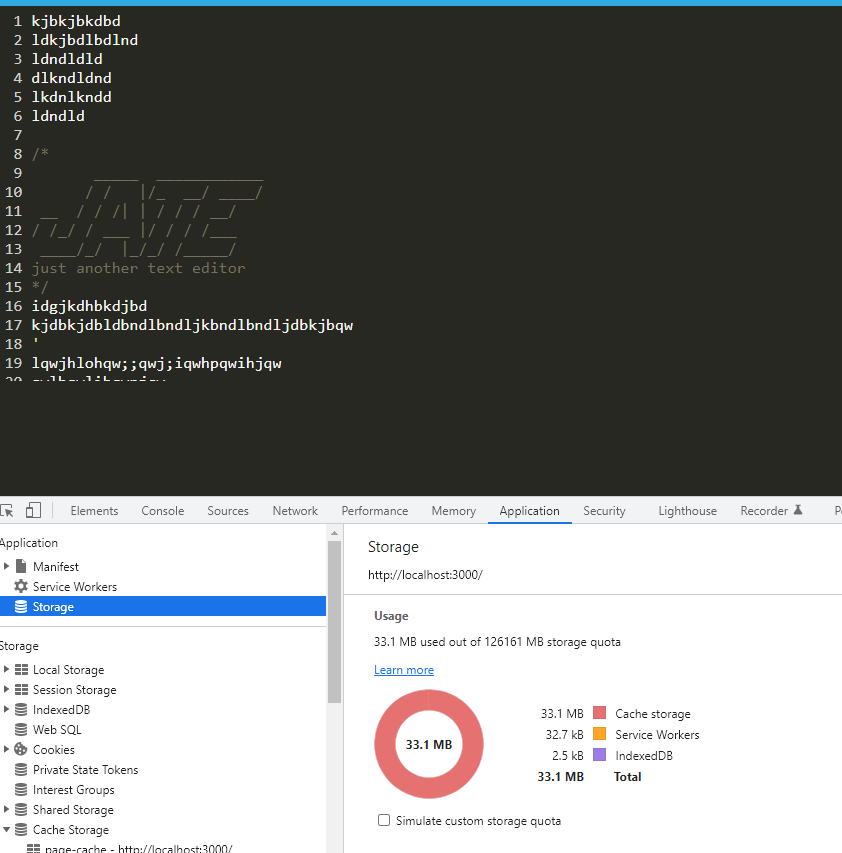
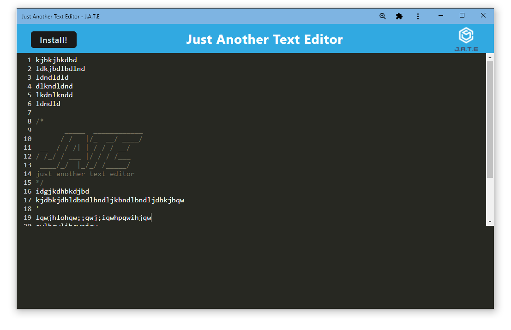

# <Title>
PWA

## Desciption

The challenge for this assignment is to have a way to save information when the computer is offline. The challenge has starter code so the only file that has to be modify is (./package.json),(./client/src/js/install.js),(./client/webpack.config.js) and (./client/src-sw.js)

## Installation
You need the do npm install (all the stuff in features). Then you can type in the terminal (npm run start:dev).

## usage
the usage is to save when you are not online.

## Features
code-mirror-themes
idb
nodemon
concurrently

## screen shoot

